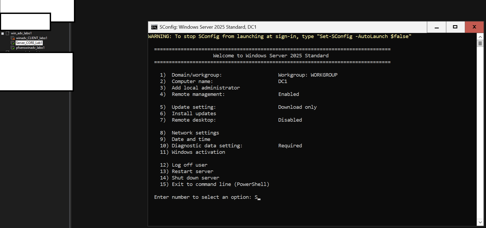
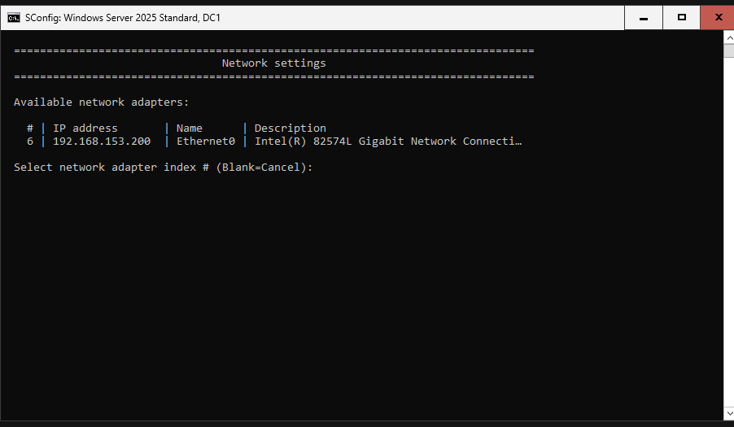
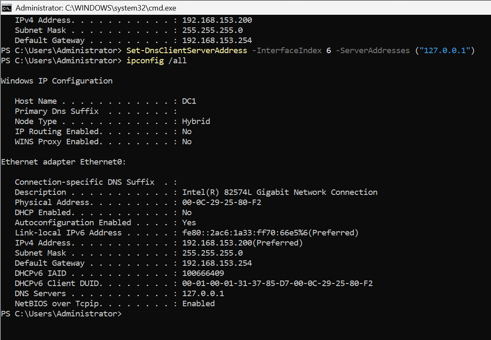

##Server Core Setup

### Context
I have installed Windows Server 2025 as Server Core on a new VM. This server will be promoted to a Domain Controller for the LOCAL.TEST forest.

Below my lab setup : 

**TASKS:**
- Change Hostname
- Install New role -> AD-Domain-Services + managementtools --> needed to manage the forest 
- Change IP address (IP/SM/DG/DNS)
- update the server after installation --> best practice
- Upgrade server_core to DC in the new forest

##Change Hostname 
`get-help rename-computer -examples` --> this gives examples we can use and adapt to what we need 

## Install New role -> AD-Domain-Services
`Install-WindowsFeature -name AD-Domain-Services -IncludeManagementTools`

## Change IP address (IP/SM/DG/DNS)

If you want to know which interface you need to install the IP. 

`get-help New-netIPAddress -Examples`--> this gives examples we can use and adapt to what we need 
If there are no examples, we can use  `Update-Help`, make sure to execute it as an administrator. 

The following command was used : 
`New-NetIPAddress -InterfaceIndex 6 -IPAddress 192.168.153.1 -PrefixLength 24 -DefaultGateway 192.168.153.1 `

## DNS

`set-DnsClientServerAddress -InterfaceIndex 6 -ServerAddresses ("127.0.0.1")`

## forest + upgrade to DC

`Install-ADDSForest -DomainName "LOCAL.TEST" -InstallDNS` --> this is the default and minimal version 
