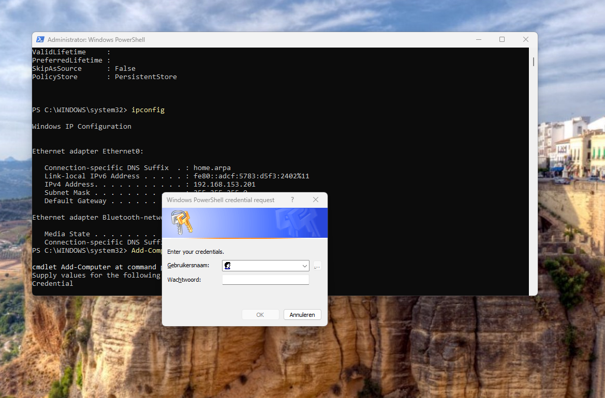
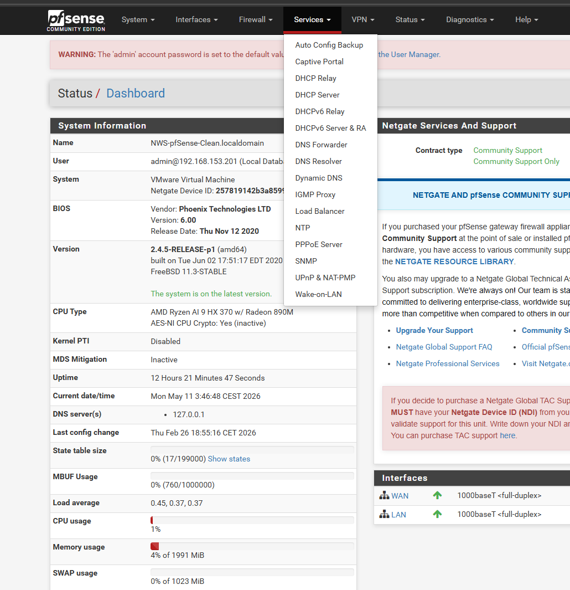
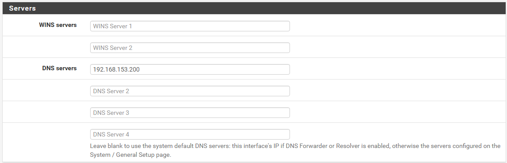
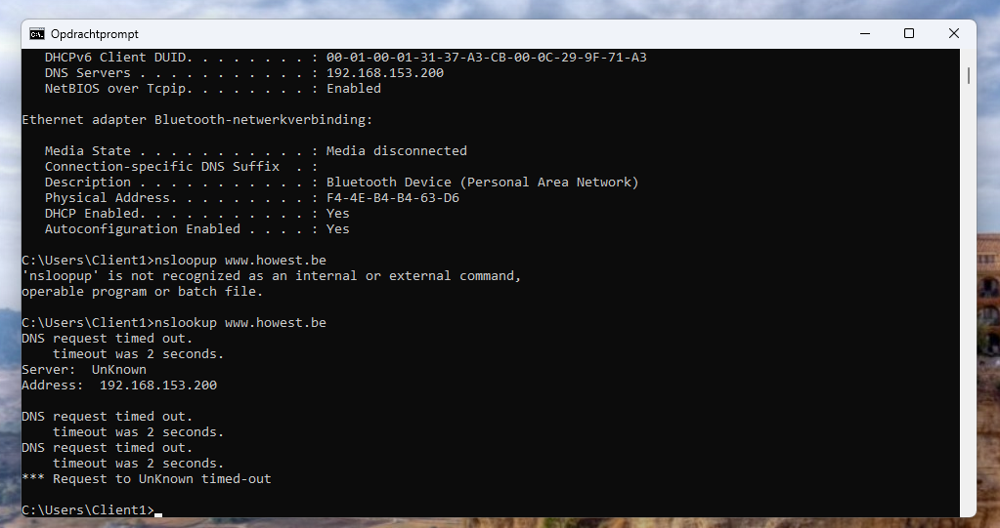
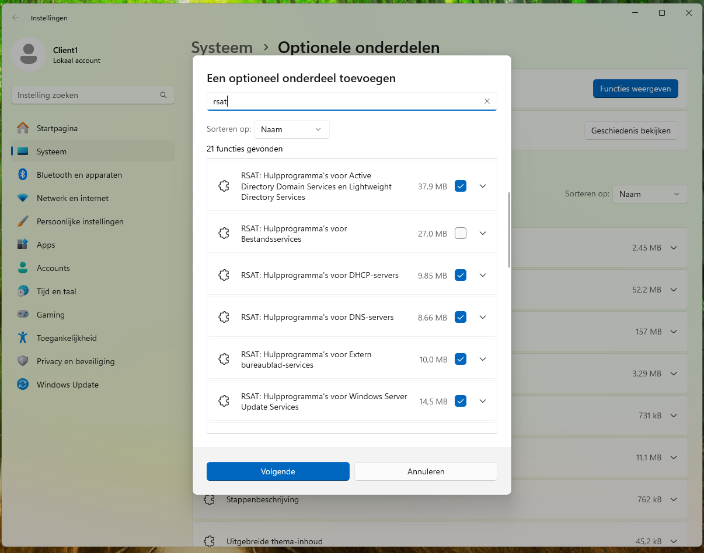

##Server Core Setup

### Context
I have installed Windows Server 2025 as Server Core on a new VM. This server will be promoted to a Domain Controller for the LOCAL.TEST forest.

Below my lab setup : 

**TASKS:**
- Change Hostname
- Install New role -> AD-Domain-Services + managementtools --> needed to manage the forest 
- Change IP address (IP/SM/DG/DNS)
- update the server after installation --> best practice
- Upgrade server_core to DC in the new forest

##Change Hostname 
`get-help rename-computer -examples` --> this gives examples we can use and adapt to what we need 

`Rename-Computer -NewName "DC1"-Restart`

*Note:** Omitted `-DomainCredential` parameter as the server is still in a WORKGROUP. This parameter is only needed when renaming domain-joined computers. Local admin rights are sufficient here since no domain exists yet—we're creating it in the next step!

## Install New role -> AD-Domain-Services
`Install-WindowsFeature -name AD-Domain-Services -IncludeManagementTools`

## Change IP address (IP/SM/DG/DNS)

If you want to know which interface you need to install the IP. 

`get-help New-netIPAddress -Examples`--> this gives examples we can use and adapt to what we need 
If there are no examples, we can use  `Update-Help`, make sure to execute it as an administrator. 

`Get-NetAdapter` --> this is how you know the interface card is  (ifIndex)

The following command was used : 
`New-NetIPAddress -InterfaceIndex 6 -IPAddress 192.168.153.200 -PrefixLength 24 -DefaultGateway 192.168.153.254 `

## DNS

`set-DnsClientServerAddress -InterfaceIndex 6 -ServerAddresses ("127.0.0.1")`

## forest + upgrade to DC

`Install-ADDSForest -DomainName "LOCAL.TEST" -InstallDNS` --> this is the default and minimal version 

# Rename Client computer 

Go to PowerShell and type : 
`Rename-computer -newName Client1`

# Add a static IP address to the client 
1) `Get-NetAdapter` 

2) `New-NetIPAddress -InterfaceIndex 11 -IPAddress 192.168.153.201 -PrefixLength 24 -DefaultGateway 192.168.153.254 `

This is putting a static IP on the client, which is needed for the lab. 

## Add client to domain 

`Add-Computer -DomainName LOCAL.TEST -Restart` 

make sure to add @LOCAL.TEST because you need admin access to add something to the domain and this refers to the admin of that domain

## (pre-RSAT) DHCP server and connection  

Before I can download anything or add any services, I need a connection. 
I need to get this done by configuring the DHCP server settings. 

in the browser 192.168.153.254 and you will be able to login

Services --> DHCP server

We add the IP address of the server 198.168.153.200 to the DNS server; this is so that the client will ask through the server for any and all DNS questions.

## TROUBLE SHOOTING

DNS Forwarders Configuration

Problem Statement
The DNS server (192.168.153.200) cannot resolve external domains because:
- No forwarders configured
- Root hints not functioning (firewall blocked)
- Clients require DC for AD DNS resolution

Solution
Configure external DNS forwarders to handle non-authoritative queries.

Implementation

PowerShell Commands 
`Add-DnsServerForwarder -IPAddress "8.8.8.8"`
`Add-DnsServerForwarder -IPAddress "8.8.4.4"`

These have to be configured on the DC because this is also the DNS server. 

`Get-DnsServerForwarder`

## RSAT 

